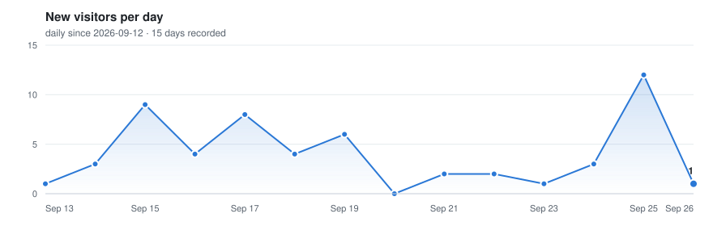

## 😎 About Me 

```python
#!/usr/bin/python
# -*- coding: utf-8 -*-

class MisterEpsilon :

    def __init__(self) :
        
        self.surname = "Epsilon"
        self.role = "PhD Student in Financial Engineering | Data Scientist"
        self.interests = ["Data Science", "Machine Learning", "Deep Learning", 
                          "Big Data", "Finance", "Economics", 
                          "Statistics", "Quantitative Analysis"]
        self.hobbies = ["Reading", "Writing", "Music", "Volleyball"]
        self.education = {
                            "degree": ["Master of Science in Data Science", 
                                        "PhD in Financial Engineering (in progress)"],
                            "university": ["University Paris 1 Panthéon-Sorbonne", 
                                          "HEC Montréal"],
                        }
        self.language_spoken = ["French", "English", "Wolof"]
        self.location = "Montreal, Canada"
        self.favorite_quote = "No weakness, strive for greatness"
        self.programming_languages = ["Python", "R", "SAS", "Scala", "pySPARK"]

    def say_hi(self) :
        print("Hello, World! This is Mister Epsilon. Welcome to my GitHub profile. \n"
              "I am a {} based in {}. \n"
              "I am currently pursuing a {} at {}. \n"
              "I am passionate about {} and {}.\n"
              "I speak {} and my favorite quote is: '{}'.\n"
              "I am proficient in {}.".format(self.role, 
                                              self.location, 
                                              self.education["degree"][1], 
                                              self.education["university"][1], 
                                              ', '.join(self.interests), 
                                              ', '.join(self.hobbies), 
                                              ', '.join(self.language_spoken), 
                                              self.favorite_quote, 
                                              ', '.join(self.programming_languages))
              )

me = MisterEpsilon()
me.say_hi()
```

## 🛠️ Tools & Technologies

[](https://www.python.org/)
[](https://www.r-project.org/)
[](https://www.sas.com/)
[](https://code.visualstudio.com/)
[](https://www.scala-lang.org/)
[](https://spark.apache.org/)
[](https://www.linux.org/)


## 📊 GitHub stats

<p align="center">
  
  
</p>

<p align="center">
  <a href="https://git.io/streak-stats"></a>
</p>

## 📈 Visitors

<p align="center">
  <picture>
    <source media="(prefers-color-scheme: dark)" srcset="resources/visitors-dark.svg" />
    
  </picture>
</p>
